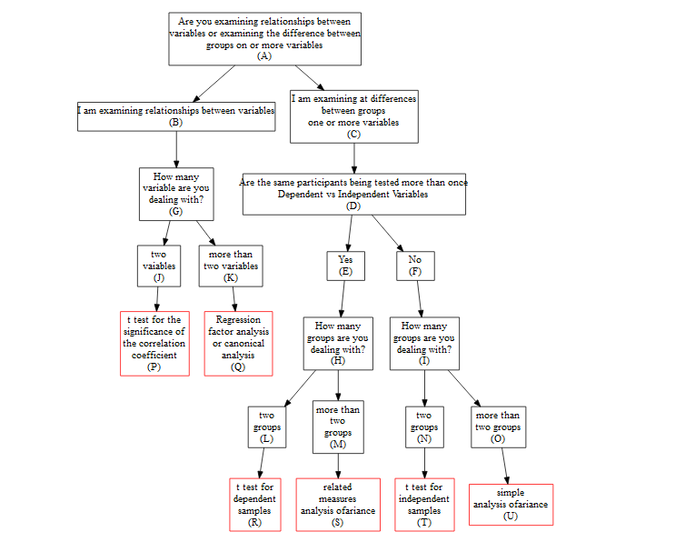
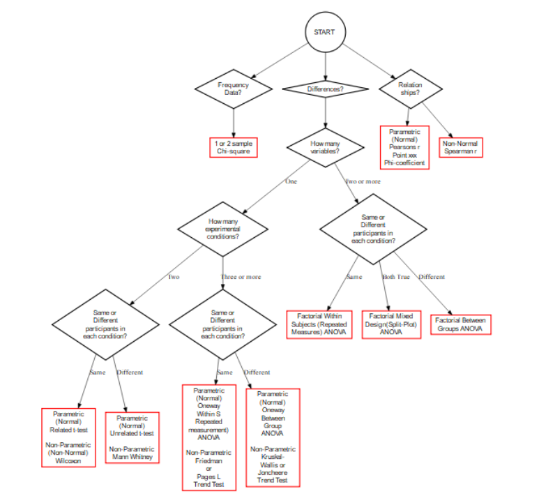
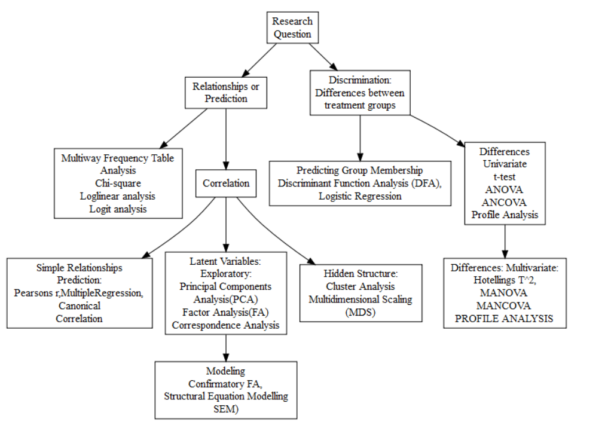
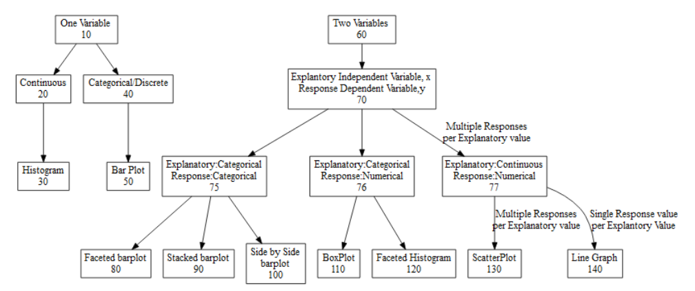

```{r setup, include=FALSE}
knitr::opts_chunk$set(echo = TRUE)
```

```{r libraries, echo=FALSE}
library(DiagrammeR)
```

We can select an appropriate test simply by answering some questions.

*  **What type of data do we have?**
    *  If we have Frequency Data, we select the Chi-square family
    *  Continuous and categorical variables will have a variety of different test depending on the research question:
*  **What type of research question are we considering?**
    *  If focus is on differences we go to the family of tests concerned with comparing groups or treatments(i.e. ANOVA)
    *  if the focus is on relationships between variables, we go to the correlation tests.
    *  If we want to predict outcomes we go to the regression family.
*  **How many variables, how many gorups are we including?**
*  Are observations independent from each other or purposely paired?
*  Is my data normally distributed?

## Relationships


```{r relationship diagram,results='hide',echo = FALSE}
# https://www.youtube.com/watch?v=tfiDu--7Gmg
grViz('
    digraph ExamineRelationships{
        #
        # add node statements
        #
        node [ shape = box]
        A[label="Are you examining relationships between\n" +
                "variables or examining the difference between\n" +
                "groups on or more variables\n(A)"];
        B[label="I am examining relationships between variables\n(B)"];
        C[label="I am examining at differences\n"+
                "between groups\n" +
                "one or more variables\n(C)"];
        D[label="Are the same participants being tested more than once\nDependent vs Independent Variables\n(D)"];
        E[label="Yes\n(E)"];
        F[label="No\n(F)"];
        G[label="How many\nvariable are you\ndealing with?\n(G)"];
        H[label="How many\ngroups are you\ndealing with?\n(H)"];
        I[label="How many\ngroups are you\ndealing with?\n(I)"];
        J[label="two\nvaiables\n(J)"]
        K[label="more than\ntwo variables\n(K)"]
        L[label="two\ngroups\n(L)"]
        M[label="more than\ntwo\ngroups\n(M)"]
        N[label="two\ngroups\n(N)"]
        O[label="more than\ntwo groups\n(O)"]


        node [color="red"]
        P[label="t test for the\nsignificance of\nthe correlation\ncoefficient\n(P)",fillcol="red"]
        Q[label="Regression\nfactor analysis\nor canonical\nanalysis\n(Q)"]
        R[label="t test for\ndependent\nsamples\n(R)"]
        S[label="related\nmeasures\nanalysis of\variance\n(S)"]
        T[label="t test for\nindependent\nsamples\n(T)"]
        U[label="simple\nanalysis of\variance\n(U)"]

            node [ shape = circle
                  ,fontname = Helvetica
                  ,penwidth = 2.0
                 ]

            # add edge statements
            A -> {B C}; 

            B -> G;         C -> D;

            G -> {J K};     D -> {E F}

            J -> P; K -> Q;     E -> H; F -> I;      
                                
                                H -> {L M};     I -> {N O};

                                L -> R; M -> S;  N -> T; O -> U;

            # add a graph statement
            graph [nodesep = 0.3]
        }
      '
      )
```



## Data

```{r relationship diagram2,results='hide',echo = FALSE}
# https://www.youtube.com/watch?v=tfiDu--7Gmg
grViz('
    digraph ExamineRelationships{
        #
        # add node statements
        #
        node [ shape = circle
                  ,fontname = Helvetica
                  ,penwidth = 2.0
                 ]
        START;
        node [ shape = diamond]

        FD[label="Frequency\nData?"]
        DD[label="Differences?\n"]
        RD[label="Relation\nships?"];
        HMV[label="How many\nvariables?"];
        HMEC[label="How many\nexperimental\nconditions?"];
        SDP1[label="Same or\nDifferent\nparticipants in\neach condition?"];
        SDP2[label="Same or\nDifferent\nparticipants in\neach condition?"];
        SDP3[label="Same or\nDifferent\nparticipants in\neach condition?"];
        START -> {FD DD RD}
        DD -> HMV 
        HMV -> HMEC [label = "One"]
        HMV -> SDP1 [label = "Two or more"]
        HMEC -> SDP2 [label = "Two"]
        HMEC -> SDP3 [label = "Three or more"]
            # add a graph statement
            graph [nodesep = 0.3]

        node [ shape = box, color = "red"]
        Chi[label = "1 or 2 sample\n Chi-square"]
        Pearson[label="Parametric\n(Normal)\nPearsons r\nPoint xxx\nPhi-coefficient"]
        Spearman[label="Non-Normal\nSpearman r\"]
        Pt[label="Parametric\n(Normal)\nRelated t-test\n\nNon-Parametric\n(Non-Normal)\nWilcoxon"]
        PUt[label="Parametric\n(Normal)\nUnrelated t-test\n\nNon-Parametric\nMann Whitney"]
        PO[label="Parametric\n(Normal)\nOneway\nWithin S\nRepeated\nmeasurement)\nANOVA\n\nNon-Parametric\nFriedman\nor\nPages L\nTrend Test"]
        POB[label="Parametric\n(Normal)\nOneway\nBetween\nGroup\nANOVA\n\nNon-Parametric\nKruskal-\nWallis or\nJoncheere\nTrend Test"]

        FWS[label="Factorial Within\nSubjects (Repeated\nMeasures) ANOVA"]
        FWD[label="Factorial Mixed\nDesign(Split-Plot)\nANOVA"]
        FBG[label="Factorial Between\nGroups ANOVA"]
        FD -> Chi
        RD -> {Pearson Spearman}
        SDP1 -> FWS[label="Same"]
        SDP1 -> FWD[label="Both True"]
        SDP1 -> FBG[label="Different"]
        SDP2 -> Pt [label="Same"]
        SDP2 -> PUt[label="Different"]
        SDP3 -> PO [label="Same"]
        SDP3 -> POB [label="Different"]
        }
      '
      )
```




## Research Question

```{r research,results='hide',echo = FALSE}
# https://www.youtube.com/watch?v=tfiDu--7Gmg
grViz('
    digraph ExamineRelationships{
        #
        # add node statements
        #

        node [ shape = box]
        10[label="Research\nQuestion"]
        20[label="Relationships or\nPrediction"]
        30[label="Discrimination:\nDifferences between\ntreatment groups"]
        40[label="Multiway Frequency Table\nAnalysis\nChi-square\nLoglinear analysis\nLogit analysis"]
        50[label="Predicting Group Membership\nDiscriminant Function Analysis (DFA),\nLogistic Regression"]
        60[label="Differences\nUnivariate\nt-test\nANOVA\nANCOVA\nProfile Analysis"]
        70[label="Correlation"]
        80[label="Simple Relationships\nPrediction:\nPearsons r,MultipleRegression,\nCanonical \nCorrelation"]
        90[label="Latent Variables:\nExploratory:\nPrincipal Components\nAnalysis(PCA)\nFactor Analysis(FA)\nCorrespondence Analysis"]
        100[label="Hidden Structure:\nCluster Analysis\nMultidimensional Scaling\n(MDS)"]
        110[label="Differences: Multivariate:\nHotellings T^2,\nMANOVA\nMANCOVA\nPROFILE ANALYSIS"]
        120[label="Modeling\nConfirmatory FA,\nStructural Equation Modelling\nSEM)"]
        
        10 -> {20 30}
        20 -> {40 70}
        30 -> 50 
        30 -> 60
        60 -> 110
        70 -> {80 90 100}
        90 -> 120


        }
      '
      )
```




## Plotting 

```{r Plotting,results='hide',echo = FALSE}
# https://www.youtube.com/watch?v=tfiDu--7Gmg
grViz('
    digraph Plotting{
        #
        # add node statements
        #
        node [ shape = box]
        10[label="One Variable\n10"]
        20[label="Continuous\n20"]
        30[label="Histogram\n30"]
        40[label="Categorical/Discrete\n40"]
        50[label="Bar Plot\n50"]
        60[label="Two Variables\n60"]
        70[label="Explantory Independent Variable, x\n  Response Dependent Variable,y\n70"]
        80[label="Explanatory:Categorical\nResponse:Categorical\n80"]
        90[label="Explanatory:Categorical\nResponse:Numerical\n90"]
       100[label="Explanatory:Continuous\nResponse:Numerical\n100"]
       110[label="Faceted barplot\n110"]
       120[label="Stacked barplot\n120"]
       130[label="Side by Side\nbarplot\n130"]

       140[label="BoxPlot\n140"]
       150[label="Faceted Histogram\n150"]

       160[label="ScatterPlot\n160"]
       170[label="Line Graph\n170"]
        
       { rank = same; 10 60 }


        10 -> 20 -> 30
        10 -> 40 -> 50
        60 -> 70 -> 80 -> {110 120 130}
        70 -> 90 -> {140 150}
        70 -> 100 -> 160 [label="Multiple Responses\nper Explanatory value"]
        100 -> 170[label="Single Response value\nper Explantory Value"]

        }
      '
      )
```



